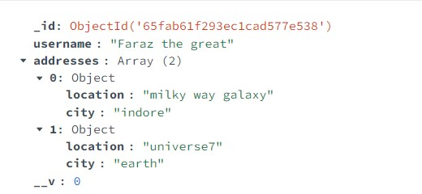

## One to few

```apache
const userSchema = mongoose.Schema({
    username : String,
    addresses :[
        {
            _id : false,//Using false won't create object id for each individual object of an array
            //as the sub-object is being considered as another schema.
            location : String,
            city : String,
        },
    ],
});

const User = mongoose.model('User' , userSchema)
module.exports = User
```

adresses is an array of objects where each object has some properties. The subobjects will get treated as another shcema and ObjectId will get generated for them as well if you don't use `_id:false`



## One to many

Store the reference of child document inside parent.

in schema, use `type : mongoose.Schema.Types.ObjectId` and `ref : 'name of collection in singular form'` like `ref :'Order'`

At the time of creation and saving the object to a collection, add the whole object at the place of 'ref'. The object will get replaced by it's ObjectId in the database.

At the time of fetching data, use `populate` to populate the document with the document whole Id is stored.

```apache
    let cust1 = new Customer({
        name : "faraz the great",
    });

    const order1 = await Order.findOne({item:"mobile"})
    const order2 = await Order.findOne({item:"laptop"})

    cust1.orders.push(order1)
    cust1.orders.push(order2)

    const res = await cust1.save()
```

```apache
const result=await Customer.findOne({}).populate('orders')
//Populates the orders field with the actual documents based on the id stored in orders field.
```

## One to Squillions

opposit of the above approach. We will store the reference to the parent inside of the child.
